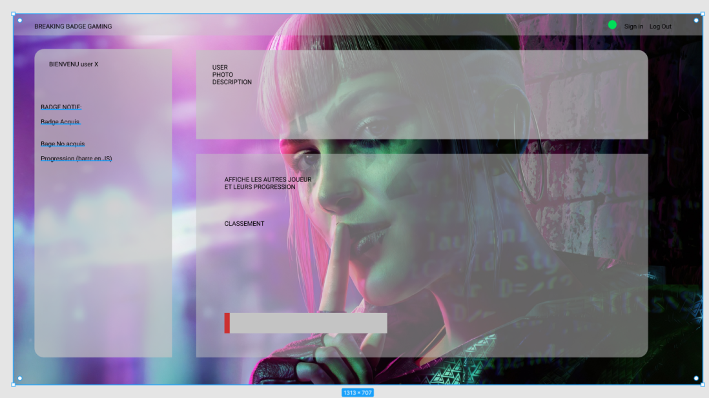
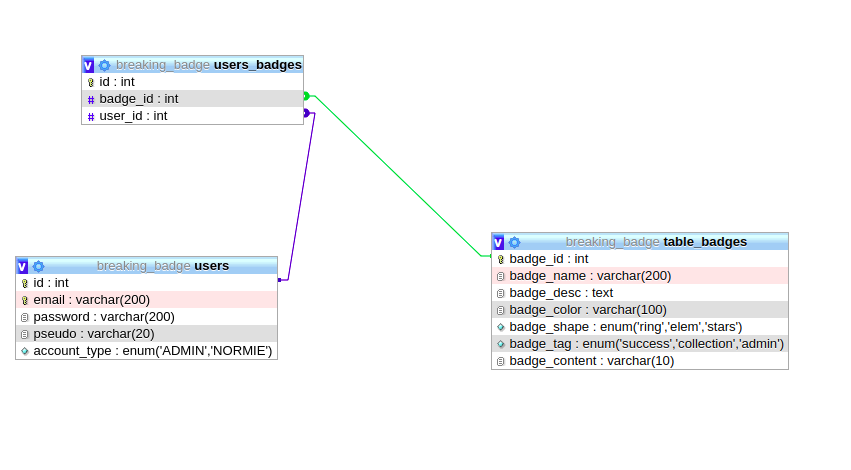

# Table of Content
* [Team](#Team)
* [Introduction](#Introduction)
* [Technologies](#Technologies)
* [Setup](#setup)
* [Improvements](#Improvements)
* [Contributing](#Contruting)
* [Web page overview](#preview)
Web page overview


# Team

Our team members are:

- [Audrey Gilmant](https://github.com/GAudrey)
- [Floriant Bertchi](https://github.com/Bruxellesflorian/)
- [Aurore VanHoorebeke](https://github.com/AuroreVanHoorebeke) 
- [Richard Ibambasi](https://github.com/GuyRichardib)


# Introduction

AS a part of our becode training, We have been asked to create a plateform with a relational database. 

#Here are the main instructions given:

>* Create a fullstack application
>* Create a relational database, with many-to-many relationships
>* Split the logic of your app using a view-controller approach
>* Design a basic permission system


# Technologies:

* HTML
* JS
* CSS
* PHP
* SQL
* phpmyadmin
* Figma
* Trello
* Git hub


# Setup

### Github
Github was the main tool used in order to gather all of our works combined. You can find it the following repo [here](https://github.com/AuroreVanHoorebeke/breaking-badge).
```git
git init
git clone (url)
```
### Management
We used [Trello](https://trello.com/b/jNzWNQ78/breaking-badge) to keep track of our work process and made mornings and afternoons briefs to stay aligned with the final objectives.

### Design
Our website designed with a pprototype that We made with Figma.

Here is an image of the database architecture.



# Improvements
We wish to improve:

* responsiveness
* use of /includes missing functions
 
# Contributing
Pull requests are mandatory. Our team was asked to make commits and pull request often to keep track of everybody's work.
Please make sure to update tests as appropriate.

# Web page overview
                                                   (Loading page)
                                


                                                    (User page)
                                

                                                  (Admin page)
                                


## Disclaimer
<strong>Fair use disclaimer</strong> this website is for educational purposes only.
